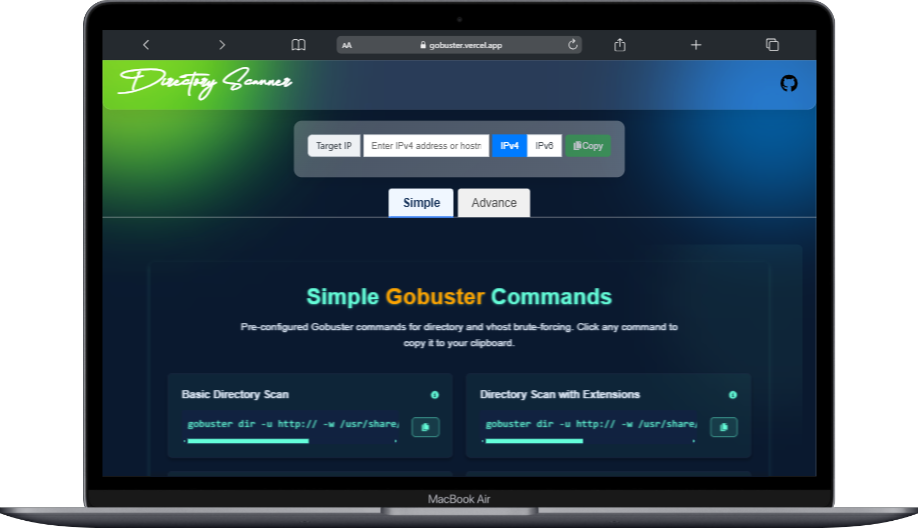
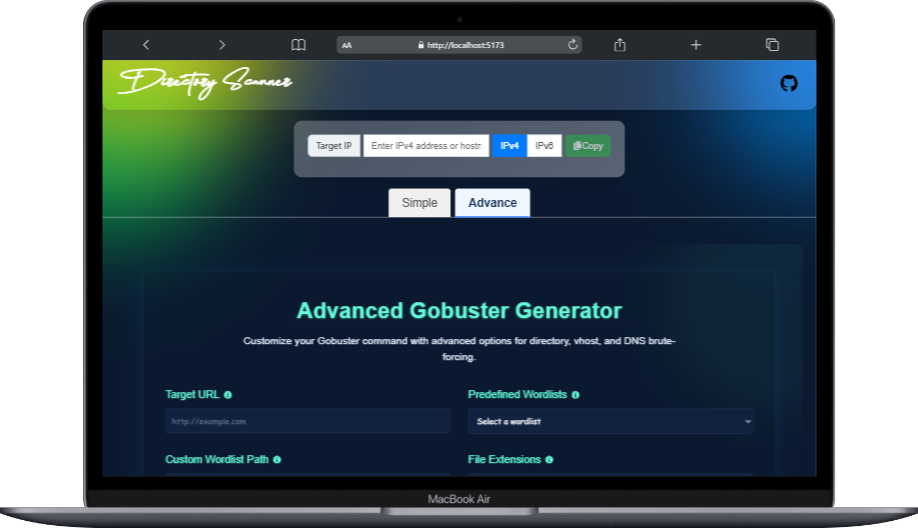
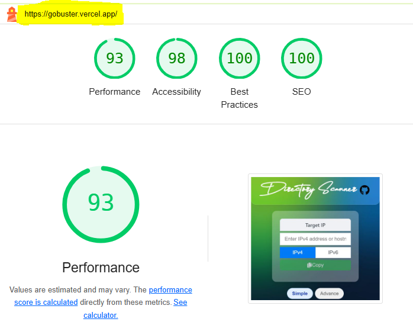

# Gobuster Command Generator



---

## Overview

Gobuster Command Generator is a web application designed to simplify the creation of Gobuster commands for directory and virtual host brute-forcing. It provides two modes: Simple Mode for quick access to pre-configured commands and Advanced Mode for detailed customization. The application is built using React with a focus on user-friendly interfaces and real-time command generation.

---

## Features

- **Simple Mode**: Offers a collection of pre-configured Gobuster commands for common use cases, such as basic directory scans, scans with file extensions, and virtual host enumeration. Users can copy commands with a single click.
- **Advanced Mode**: Allows users to customize Gobuster commands by specifying target URLs, wordlists, file extensions, performance settings, status code filtering, and advanced options like proxy settings and custom headers.
- **Tooltips**: Provides contextual help for each input field and command, explaining its purpose and usage.
- **Responsive Design**: Ensures usability across desktop and mobile devices.
- **Clipboard Support**: Enables users to copy generated commands easily.
- **Tips Section**: Includes practical advice for optimizing Gobuster usage in both modes.

---

## Live Site

The application is deployed and accessible at [gobuster.vercel.app](https://gobuster.vercel.app).

---

## Repository

The source code is available on GitHub at [https://github.com/AbdulAHAD968/Gobuster-Command-Generator](https://github.com/AbdulAHAD968/Gobuster-Command-Generator).

---

## Installation

To run the application locally, follow these steps:

1. **Clone the Repository**:
   ```bash
   git clone https://github.com/AbdulAHAD968/Gobuster-Command-Generator.git
   cd Gobuster-Command-Generator
   ```

2. **Install Dependencies**:
   ```bash
   npm install
   ```

3. **Start the Development Server**:
   ```bash
   npm start
   ```

   The application will be available at `http://localhost:3000`.

---

## Usage

1. **Simple Mode**:
   - Navigate to the Simple Mode section.
   - Browse pre-configured commands for various Gobuster use cases.
   - Hover over the info icon next to each command for an explanation.
   - Click the copy button to copy the command to your clipboard.

2. **Advanced Mode**:
   - Navigate to the Advanced Mode section.
   - Enter the target URL and select or specify a wordlist.
   - Customize options such as file extensions, threads, timeout, status codes, and advanced settings like proxy or custom headers.
   - The generated command updates in real-time and can be copied to the clipboard.



3. **Tips**:
   - Review the tips section in both modes for guidance on optimizing Gobuster commands.
   - Use the `-k` flag for HTTPS targets with self-signed certificates or adjust threads with `-t` for performance tuning.

---

## Technologies Used

- **Frontend**: React, React Icons, Tailwind CSS
- **Deployment**: Vercel
- **Other**: JavaScript, HTML, CSS

---

## Contributing

Contributions are welcome. To contribute:

1. Fork the repository.
2. Create a new branch for your feature or bug fix:
   ```bash
   git checkout -b feature/your-feature-name
   ```
3. Commit your changes:
   ```bash
   git commit -m "Add your commit message"
   ```
4. Push to the branch:
   ```bash
   git push origin feature/your-feature-name
   ```
5. Open a pull request on GitHub.

Please ensure your code follows the project's coding standards and includes appropriate tests.

---

## License

This project is licensed under the MIT License. See the [LICENSE](LICENSE) file for details.

---

## Contact

For questions or feedback, please open an issue on the [GitHub repository](https://github.com/AbdulAHAD968/Gobuster-Command-Generator/issues).

## Google-Lighthouse Audit Score

